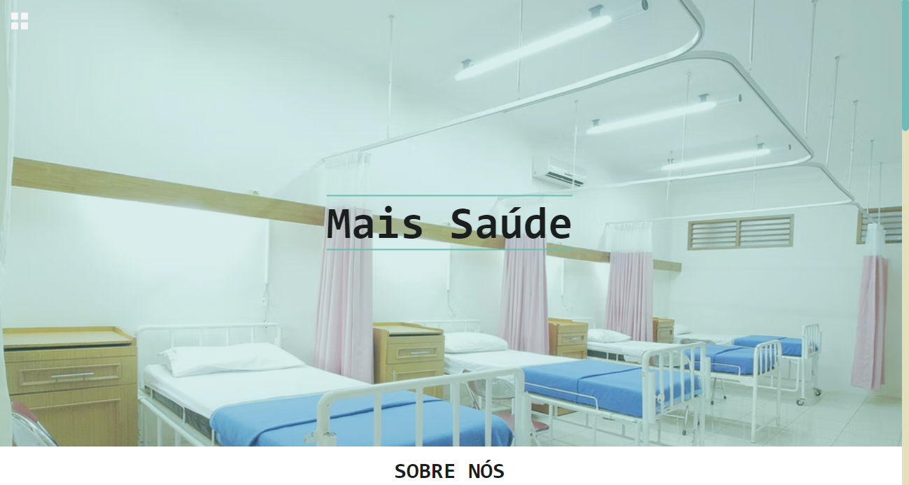
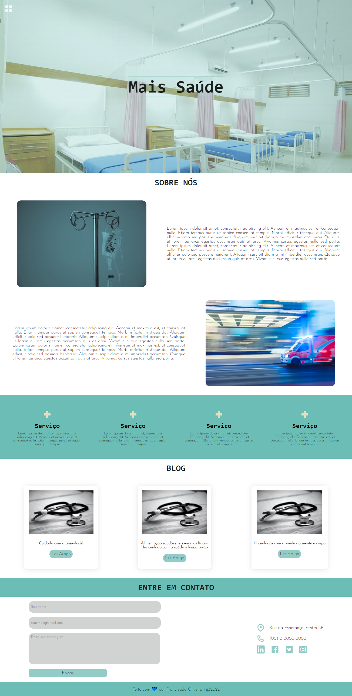

 
&#xa0;
 
<!-- <a href='linkdosite'>Demo</a> -->
 

 
<h1 align='center'>Mais Saúde | Site</h1>
 

 

 

 

 

 

<a href='#dart-sobre'>Sobre</a> &#xa0; | &#xa0;
<a href='#memo-licença'>Licença</a> &#xa0; | &#xa0;
<a href='https://github.com/fransilva0' target='_blank'>Autor</a>

 
 
 
## :dart: Sobre ##
 

  O Site foi construído para treinamento em criação de sites, sendo um site de estudos. As imagens do projeto vieram do banco de imagens gratuitas Unsplash e os ícones do Iconify. O site contém duas páginas, sendo a primeira considerada a principal, seguida da segunda que foi construída para adicionar a grade de profissionais presentes no Hospital fictício "Mais Saúde".

 

  As bibliotecas JavaScript usadas nesse projeto foram o ScrollReveal e o Typed. O primeiro foi responsável pela animação de aparecimento dos elementos ao rolar a página, já o segundo foi responsável pela animação de digitação do titulo no Header.

## PÁGINA INICIAL NO DESKTOP

 

## PÁGINA DE PROFISSIONAIS NO DESKTOP

## :memo: Licença ##
 
Este projeto está sob licença MIT. Veja o arquivo [LICENSE](LICENSE.md) para mais detalhes.
 
 
Feito com :heart: por <a href='https://github.com/fransilva0' target='_blank'>Francileudo Oliveira</a>
 
&#xa0;
 
<a href='#top'>Voltar para o topo</a>